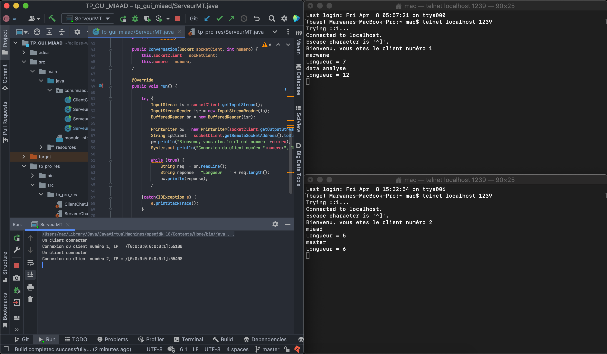
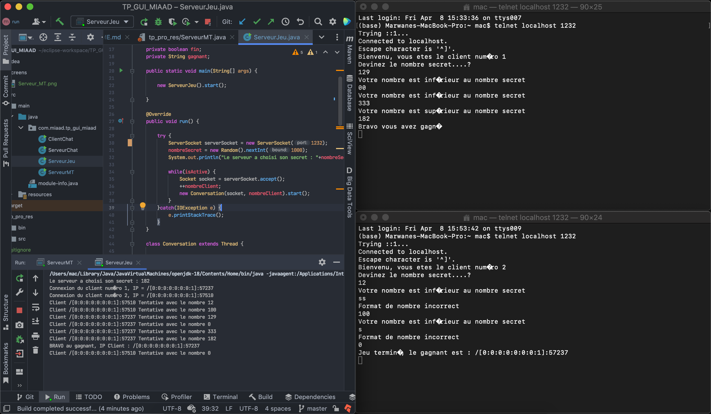
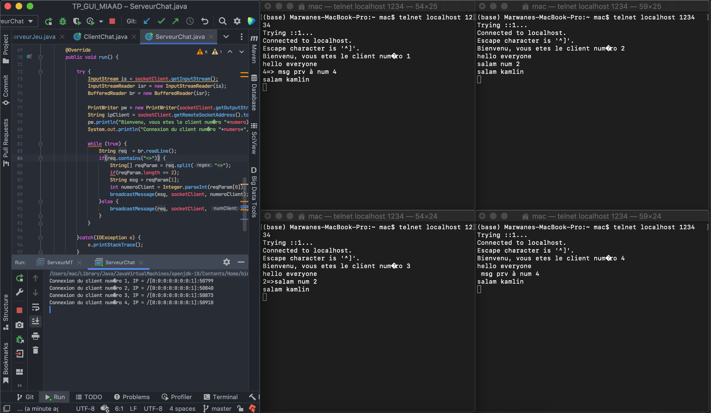
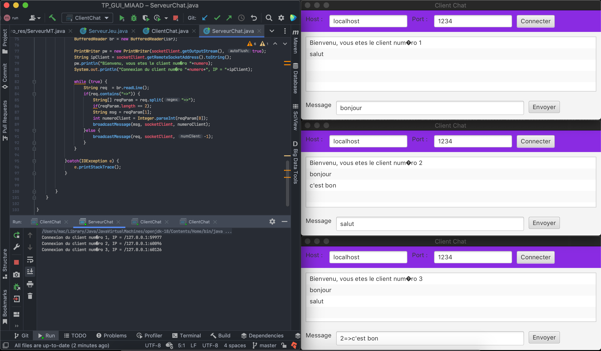

## Part 5

Dans cet partie on est ajouter à la deuxiéme application client/serveur la tache suivant:
- Mettre en oeuvre la possibilité de compter le nombre des characteres dans un string donnée par utilisateur

## Part 6

C'est comme la dernier partie on est ajouter au notre application client/serveur une petite jeu qui permet a:
- Deviner un nombre choisi aléatoirement par le serveur
- La possibilité de jouer en multi joueurs

## Part 7

Maintenant on fait un chat qui permet a multi utilisateur à communiquer entre eux en deux modes:
1. Broadcast diffuser le message au tous les utilisateurs qui sont connectés
2. Mode privée on specifient un code comme ça `[ID-Chat]=>[Notre message ici]` dans notre message (ex: `2=>Bonjour numero 2`)

## Part 8 et 9

On ajoutons une interface graphique au notre chat qui permet a chaque utilisateur à communiquer facilement en les deux modes:
1. Broadcast diffuser le message au tous les utilisateurs qui sont connectés
2. Mode privée on specifient un code comme ça `[ID-Chat]=>[Notre message ici]` dans notre message (ex: `2=>Bonjour numero 2`)

